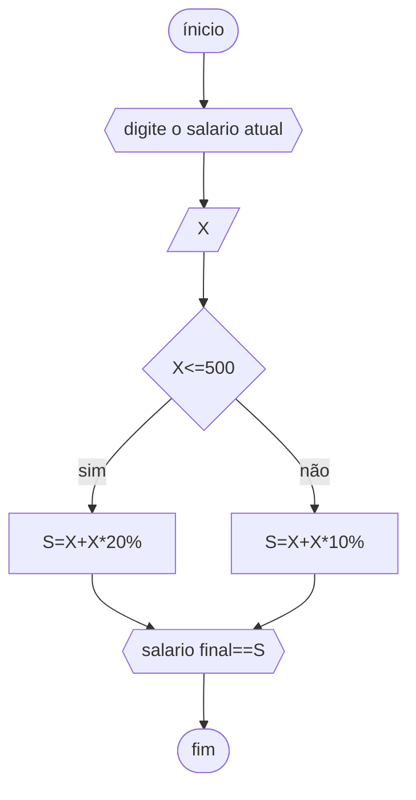

# unifor
## fluxograma
### exercício_2



## pseudocódigo
```
ALGORITMO 
DECLARE X, S NUMÉRICO
ESCREVA "DIGITE O SALÁRIO ATUAL"
LEIA X
SE X<=500
ENTÃO S⇐X+(X*20%)
SENÃO S⇐X+(X*10% )
ESCREVA "SALÁRIO FINAL=" S
FIM_ALGORITMO.
```
