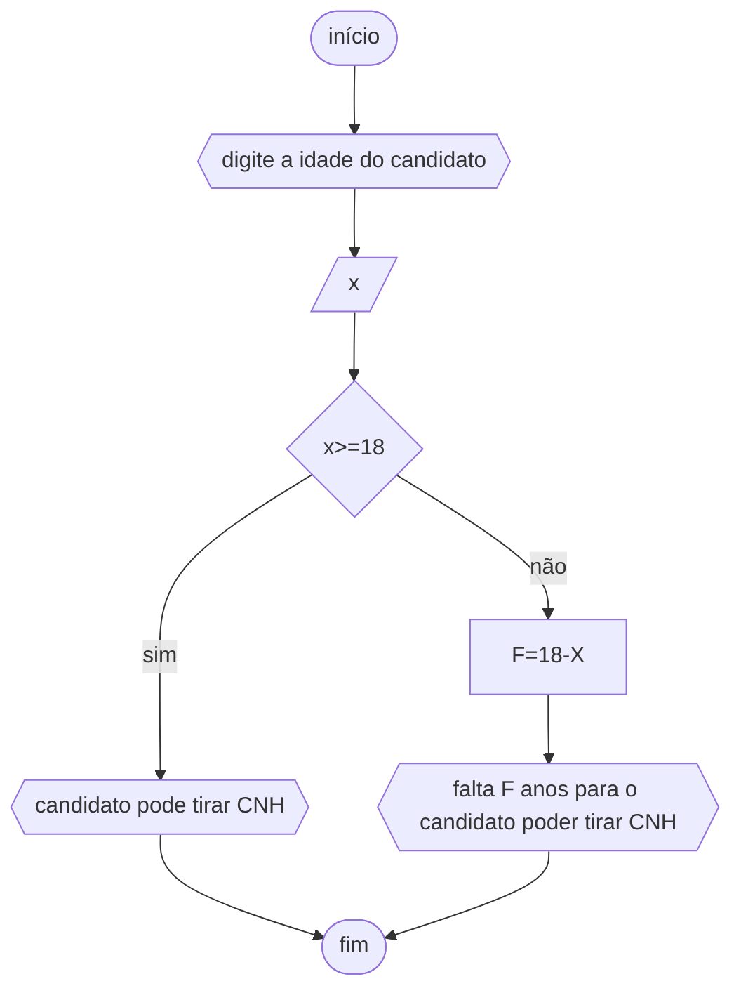

# unifor
## fluxograma
### exercício4


## pseudocódigo
```
ALGORITMO
DECLARE X NUMÉRICO
ESCREVA"DIGITE A IDADE DO CANDIDATO"
LEIA X
SE X>=18
ENTÃO ESCREVA "PODE TIRAR CNH"
SENÃO F⇐18-X
ESCREVA "FALTAM"F"ANO(s) PARA PODER TIRAR CNH" 
FIM_ALGORITMO
```

