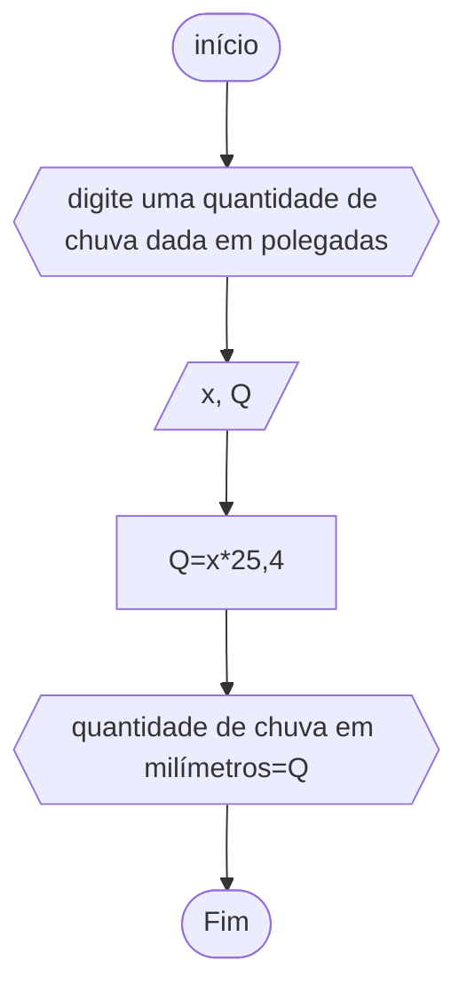

# unifor
## fluxograma
### exercício2.1


## pseudodrama
```
ALGORITMO calcmédia
DECLARE X1, X2 , X3, X4, M NÚMERICO INTEIRO
INÍCIO
ESCREVA"DIGITE QUATRO NOTAS DE AVALIAÇÕES "
LEIA X1, X2, X3, X4
M<--(X1+X2+X3+X4)/4
ESCREVA"MÉDIA="M
FIM_ALGORITMO
```


## fluxograma
### exercício2.2

## pesudograma
```
ALGORITMO calctemperatura
DECLARE c, F NÚMERICO
INÍCIO
ESCREVA "digite a temperatura em Celsius"
LEIA c
F<--(9/5*c)+32
ESCREVA "Temperatura em Fahrenheit é de" F
FIM_ALGORITMO```
```

## fluxograma
### exercício2.3


## pesudograma
```
ALGORITMO calcquantidade de chuva em polegadas
ESCREVA"digite uma quantidade de chuva dada em polegadas"
DECLARE x, Q NÚMERICO
INÍCIO
LEIA x
Q<--x*25,4
ESCREVA"quantidade de chuva em milímetros="Q
FIM_ALGORITMO
```

## fluxograma
### exercício2.4


## peseudocódigo
```
ALGORIMO calccusto
DECLARE c, custo_total NÚMERICO
ESCREVA"digite o custo de fábrica do carro"
LEIA c
INÍCIO
custo_total<--c+(c*12%)+(c*45%)
ESCREVA"o conta ao consumidor"custo_total
FIM_ALGORITMO
```


## fluxogrma
### exercício2.5


    

## pseudocódigo
```
ALGORITMO calcquadrado de um número
DECLARE x, R NÚMERICO
INÍCIO
ESCREVA"digite um número"
LEIA x
R<--x^2
ESCREVA"esse número ao quadrado é "R
FIM_ALGORITMO
```

## FLUXOGRAMA
### EXERCÍCIO2.6

## pseudocódigo 
```

ALGORITMO calccusto
DECLARE qhamb, qcheese, qfritas, qrefri, qmilk NÚMERICO
DECLARE custo_final
INÍCIO
ESCREVA "digite a quantidade de cada produto seguinte, respectivamente: hambúrguer,  cheeseburger,  fritas, milkshake"
LEIA qhamb, qcheese, qfritas, qrefri, qmilk
custo_final<-- (qhburg * 3) + (qchees * 2,50) + (qfritas * 2,50) + (qrefri * 1) + (qmilk * 3)
ESCREVA "conta final é de"custo_final
FIM_ALGORITMO
```

## fluxograma
### exercício2.7


## pseudocódigo

```
ALGORITMO calcsalário
DECLARE qcarro,valor_venda,X NÚMERICO
DECLARE salário
DECLARE nome
INÍCIO
ESCREVA"digite seu nome completo:"
LEIA nome
ESCREVA"digite a quantidade de carros vendido"
LEIA qcarro
X<--500+(qcarro*50)
ESCREVA"digite o valor_venda"
LEIA valor_venda
salário<--X+valor_venda
ESCREVA"salário do vendedor é"salário
FIM_ALGORITMO
```
## fluxograma
### exrcício2.8


## psedocódigo
```
ALGORITMO calcmédia
DECLARE nome
DECLARE nota_prova, nota_qualitativa, M NÚMERICO
INÍCIO
ESCREVA "digite seu nome completo"
LEIA nome
ESCREVA "digite a nota da prova e a nota qualitativa respectivamente"
LEIA  nota_prova, nota_qualitativa
M<--[(2*nota_prova)+nota_qualitativa]/3
ESCREVA "média ="M
FIM_ALGORITMO
```
## fluxograma
### exercício2.9


## pseudocódigo
```
ALGORITMO
DECLARE matricula,  idade NÚMERICO 
DECLARE email, nome,  curso
INÍCIO
ESCREVA "preencha abaixo a ficha de inscrição com nome, matricula, curso, idade, 
 e-mail, respectivamente: "
 LEIA  nome, matricula, curso, idade, email
ESCREVA "Ficha de Inscrição"
ESCREVA "Nome: "nome
ESCREVA "Matricula: "matricula
ESCREVA "Curso: "curso
ESCREVA "Idade: "idade
ESCREVA "E-mail: "email
FIM_ALGORITMO


```

## fluxograma
### exercício2.10


## pseudocódigo
```
ALGORITMO calcarea e perimetro
DECLARE área, perímetro, raio NÚMERICO
INÍCIO
ESCREVA "digite o raio  do círculo"
área<--Ⲡ * raio^2
perímetro<-- 2 * Ⲡ * raio
ESCREVA "Área do círculo"área
ESCREVA "Perímetro do círculo"perímetro
FIM_ALGORTIMO
```

## fluxograma
### exercício2.11


## pseudocódigo
```
ALGORITMO
DECLARE x,q,c,rq,rc NÚMERICO
INÍCIO
SE x>0
ESCREVA "digite o número"
q<--x^2
c<--x^3
rq<--x^(1/2)
rc<--x^(1/3)
ESCREVA "seguinte números são respectivamente em elevação ao quadrado, elevação ao cubo, em raiz ao quadrado, raiz ao cubo:"q, c, rq, rc
SENÃO
ESCREVA "número invalido!Tente novamente!"
FIM_ALGORITMO

```
## fluxograma
### exercício2.12


## pesudocódigo
```
ALGORITMO
DESCREVA "digite os três números"
LEIA x, y, z
SE
x>y
ESCREVA "ordem será"x>y>z
  SE
  y>z
    ESCREVA"ordem será"x>y>z
  SENÃO
    ESCREVA"ordem será"x>z>y
    SEy>z
      ESCREVA"ordem será"z>x>y
    SENÃO
      ESCREVA"ordem será"x>z>y
SENÃO
ESCREVA"ordem será"y>x>z
  SE
  x>z
    ESCREVA"ordem será"y>x>z
  SENÃO
    ESCREVA"ordem será"y>z>x
FIM_SE
FIM_ALGORITMO
```

## fluxograma
## exercício2.13


## peseudocódigo

```
ALGORITMO classificação
DECLARE x NÚMERICO INTEIRO
INÍCIO
ESCREVA "digite a idade do nadador"
LEIA x
ESCOLHA
  CASO 5<=x<=7
  ESCREVA "o nadador é classificado na categoria de infantil A."
  CASO 8<=x<=10
  ESCREVA "o nadador é classificado na categoria de infantil B."
  CASO 11<=x<=13
  ESCREVA "o nadador é classificado na categoria de juvenil A."
  CASO 14<=x<=17
  ESCREVA "o nadador é classificado na categoria de juvenil B."
  SENÃO
  x>18
  ESCREVA "o nadador é classificado na categoria de adulto."
FIM_ESCOLHA
FIM_ALGORITIMO
```

## fluxograma
### exercício2.14


## pseudocógo
```
ALGORITMO observaçãonúmerico
DECLARE x, y, z NÚMERICO
INÍCIO
ESCREVA "digite os três números aleatórios"
LEIA x, y, z
SE x>y
ESCREVA "ordem será"x>y>z
SENÃO ESCREVA "ordem será"y>x>z
 SE y>z
 ESCREVA "menor será"z
 SENÃO "menor será"y
  SE x>z
  ESCREVA "menor será"z
  SENÃO ESCREVA "menor será"x
 FIM_SE
 FIM_ALGORITMO

```

## fluxograma
### exercício2.15


## pseudocógo
```
ALGORITMO calcpeso
DECLARE x,y
INÍCIO
ESCREVA "digite o peso desejado em libras(Lb)"
LEIA x
SE x>0
y<--x*2.2
ESCREVA "Peso expresso emquilogramas(Kg):"y
LEIA y
SENÃO ESCREVA "Atenção!Peso inválido!Digite novamente."
FIM_SE
FIM_ALGORITMO
```

## fluxograma
### exercício2.16


## pseudocógo
```
ALGORITMO 
DECLARE média_final NÚMERICO
INÍCIO
ESCREVA "digite a média_final"
LEIA média_final
ESCOLHA
CASO média_final>=6
ESCREVA "AP,o aluno está aprovado."
CASO média_final<3
ESCREVA "RM,o aluno está reprovado."
SENÃO "PF,o aluno está em prova final"
FIM_ESCOLHA
FIM_ALGORITMO
```
