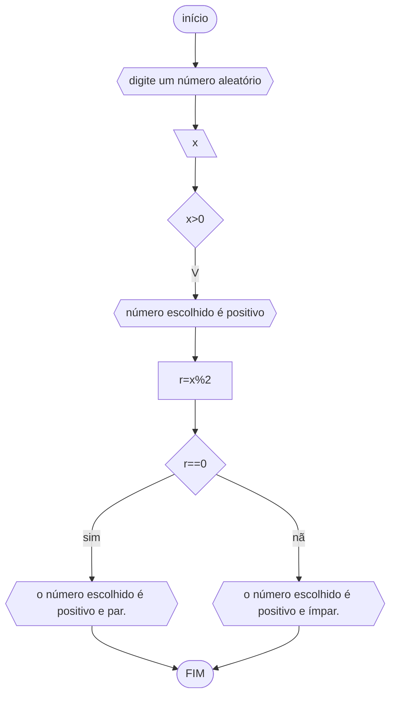

## FLUXOGRAMA
### 3.1



## PSEUDOCÓDIGO
```
ALGORITMO
ESCREVA "digite um número aleatório"
DECLARE x
INÍCIO
ENQUANTO x<0 FAÇA
	"digite um número."
FIM_ENQUANTO
ESCREVA "número escolhido é positivo"
r<--x%2
SE r==0
ESCREVA "o número escolhido é positivo e par."
SENÃO ESCREVA "o número escolhido é positivo e ímpar."
FIM_SE
FIM_ALGORITMO
```
