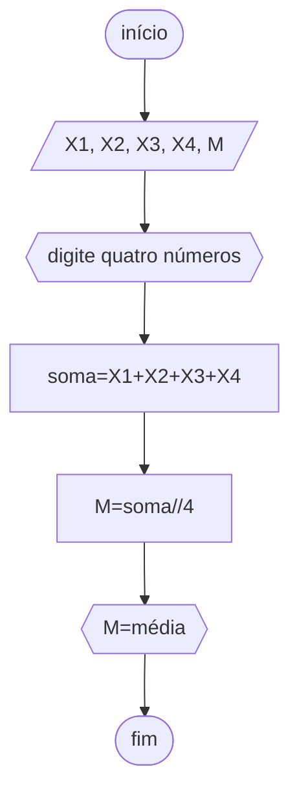

# unifor
## fluxograma
### exercício2.1



## pseudodrama
```
ALGORITMO CALCULAR MÉDIA
DECLARE X1, X2 , X3, X4, M NÚMERICO
INÍCIO
ESCREVA"DIGITE QUATRO NOTAS DE AVALIAÇÕES "
LEIA X1, X2, X3, X4
SOMA<--X1+X2+X3+X4
M<--SOMA/4
ESCREVA"MÉDIA="M
FIM_ALGORITMO
```

## teste
 ```mermaid
flowchart TD
A([início])-->B[/6, 8, 5, 5,  M/]
B-->C{{"digite quatro números"}}
C-->D[soma=6+8+5+5]
D-->E[M=24//4]
E-->F{{"M=6"}}
F-->Z([fim])
```

```
ALGORITMO CALCULAR MÉDIA
DECLARE 6, 8 , 5, 5, M NÚMERICO
INÍCIO
ESCREVA"DIGITE QUATRO NOTAS DE AVALIAÇÕES "
LEIA 6, 8, 5, 5
SOMA<--6+8+5+5
M<--24/4
ESCREVA"MÉDIA="M
FIM_ALGORITMO
```
