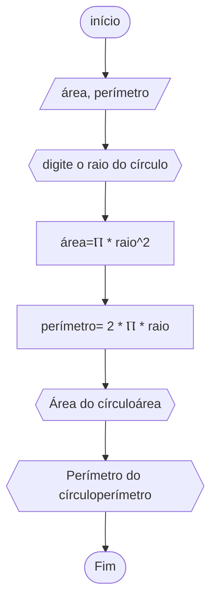

# unifor
## fluxograma
### exercício2.10



```
ALGORITMO calcarea e perimetro
DECLARE área, perímetro NÚMERICO
INÍCIO
ESCREVA "digite o raio  do círculo"
área<--Ⲡ * raio^2
perímetro<-- 2 * Ⲡ * raio
ESCREVA "Área do círculo"área
ESCREVA "Perímetro do círculo"perímetro
FIM_ALGORTIMO
```
