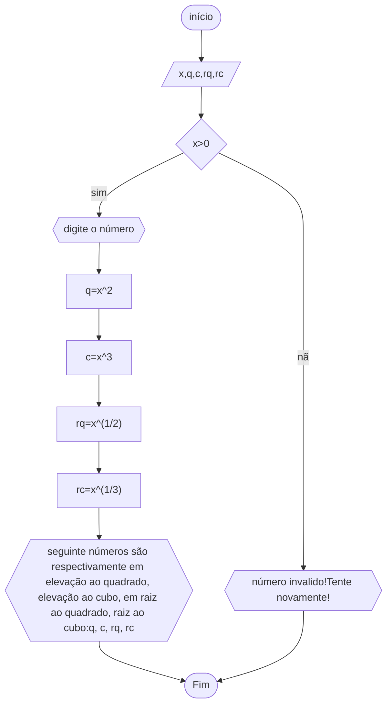

# unifor
## fluxograma
### exercício2.11



```
ALGORITMO
DECLARE x,q,c,rq,rc NÚMERICO
INÍCIO
SE x>0
ESCREVA "digite o número"
q<--x^2
c<--x^3
rq<--x^(1/2)
rc<--x^(1/3)
ESCREVA "seguinte números são respectivamente em elevação ao quadrado, elevação ao cubo, em raiz ao quadrado, raiz ao cubo:"q, c, rq, rc
SENÃO
ESCREVA "número invalido!Tente novamente!"
FIM_ALGORITMO

```
