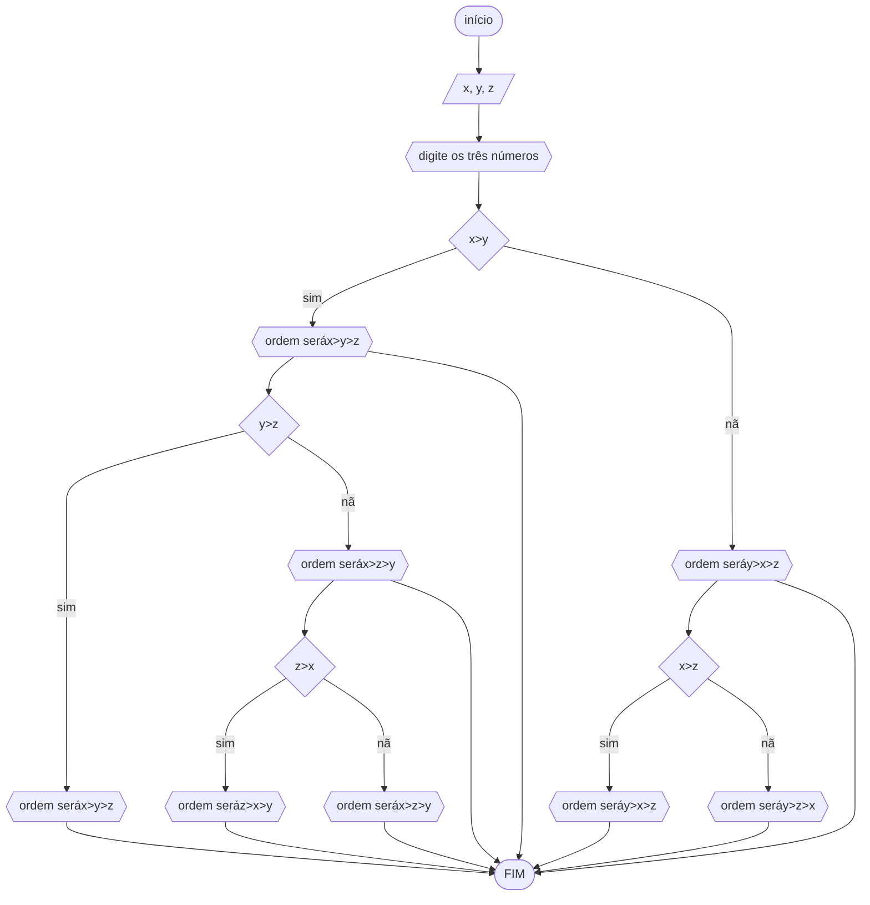

# unifor
## fluxograma
### exercício2.12

```mermaid
flowchart TD
A([início])-->B[/x, y, z/]
B-->C{{"digite os três números"}}
C-->D{x>y}
D--sim-->E{{"ordem será"x>y>z}}
D--não-->F{{"ordem será"y>x>z}}
E-->G{y>z}
G--sim-->H{{"ordem será"x>y>z}}
G--não-->I{{"ordem será"x>z>y}}
F-->M{x>z}
M--sim-->O{{"ordem será"y>x>z}}
M--não-->P{{"ordem será"y>z>x}}
I-->J{z>x}
J--sim-->L{{"ordem será"z>x>y}}
J--não-->N{{"ordem será"x>z>y}}
L-->Z([FIM])
N-->Z
O-->Z
P-->Z
H-->Z
I-->Z
E-->Z
F-->Z
```
