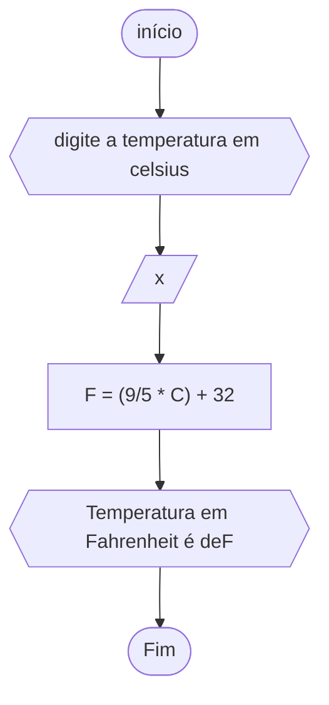

# unifor
## fluxograma
### exercício2.2

## pesudograma
```
ALGORITMO calctemperatura
DECLARE C, F NÚMERICO
INÍCIO
ESCREVA "digite a temperatura em Celsius"
LEIA C
F<--(9/5*C)+32
ESCREVA "Temperatura em Fahrenheit é de" F
FIM_ALGORITMO```
