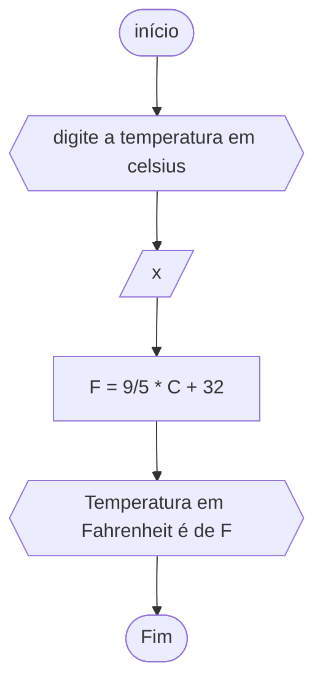

# unifor
## fluxograma
### exercício2.2

## pesudograma
```
INÍCIO
ALGORITMO
ESCREVA "digite a temperatura em Celsius"
DECLARE C, F NÚMERICO
LEIA C
F<--9/5*C+32
ESCREVA "Temperatura em Fahrenheit é de" F
FIM_ALGORITMO```
