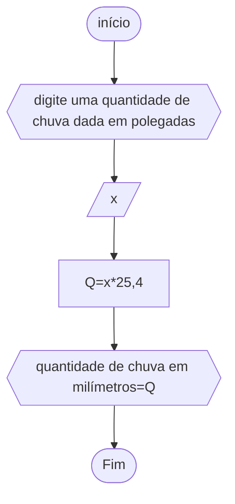

# unifor
## fluxograma
### exercício2.3


# pesudograma
```
ALGORITMO calcquantidade de chuva em polegadas
ESCREVA"digite uma quantidade de chuva dada em polegadas"
DECLARE x
INÍCIO
LEIA x
Q<--x*25,4
ESCREVA"quantidade de chuva em milímetros="Q
FIM_ALGORITMO
