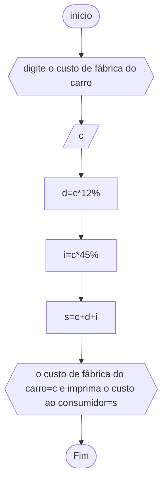

# unifor
## fluxograma
### exercício2.4


## peseudocódigo
```
ALGORIMO
ESCREVA"digite o custo de fábrica do carro"
DECLARE c
INÍCIO
d<--c*12%
i<--c*45%
s<--c+d+i
ESCREVA"o custo de fábrica do carro="c" e imprima o custo ao consumidor="s""
FIM_ALGORITMO
```
