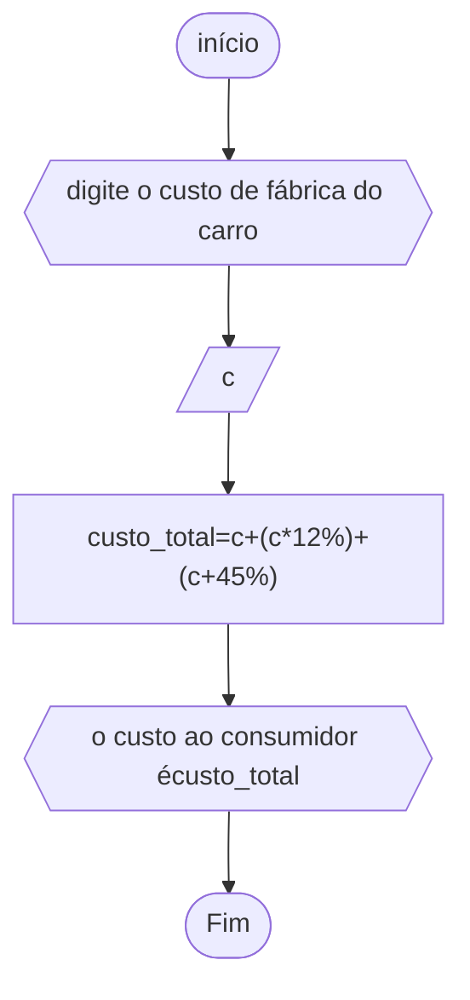

# unifor
## fluxograma
### exercício2.4


## peseudocódigo
```
ALGORIMO calccusto
DECLARE c
ESCREVA"digite o custo de fábrica do carro"
LEIA c
INÍCIO
custo_total<--c+(c*12%)+(c*45%)
ESCREVA"o conta ao consumidor"custo_total
FIM_ALGORITMO
```
