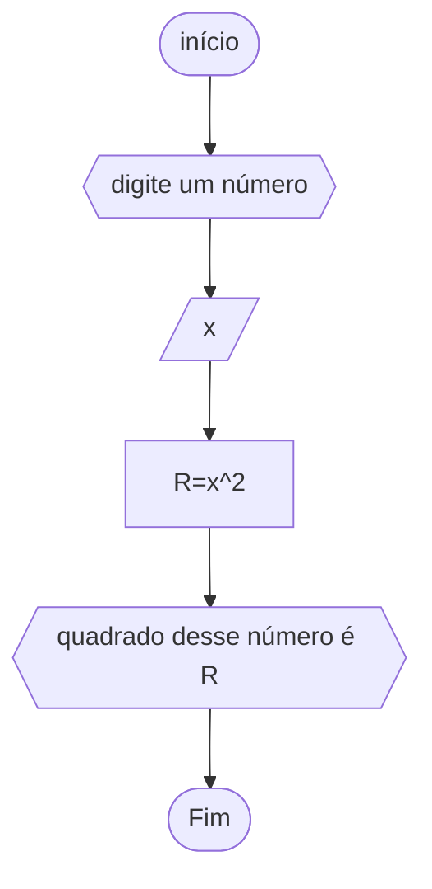

# unifor
## fluxogrma
### exercício2.5

```mermaid
flowchart TD
A([início])-->B{{"digite um número"}}
B-->C[/x/]
C-->E[R=x^2]
E-->F{{"quadrado desse número é R"}}
F-->Z([Fim])
```

## pseudocódigo
```
ALGORITMO
DECLARE x NÚMERICO
INÍCIO
ESCREVA"digite um número"
R<--x^2
ESCREVA"quadrado desse número é "R""
FIM_ALGORITMO
