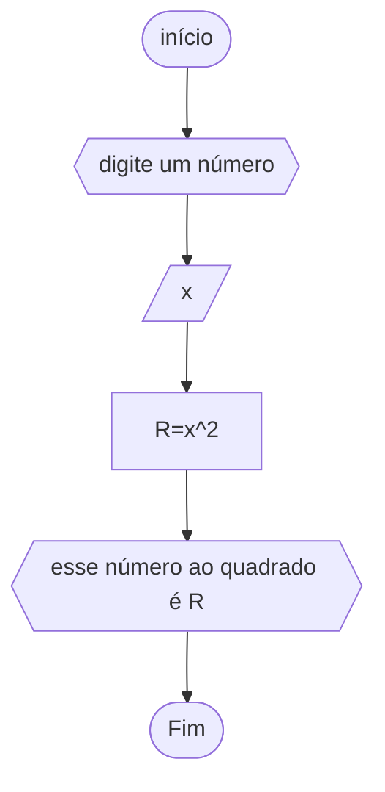

# unifor
## fluxogrma
### exercício2.5

```mermaid
flowchart TD
A([início])-->B{{"digite um número"}}
B-->C[/x/]
C-->E[R=x^2]
E-->F{{"esse número ao quadrado é "R}}
F-->Z([Fim])
```

    

## pseudocódigo
```
ALGORITMO
DECLARE x NÚMERICO
INÍCIO
ESCREVA"digite um número"
LEIA x
R<--x^2
ESCREVA"esse número ao quadrado é "R
FIM_ALGORITMO
