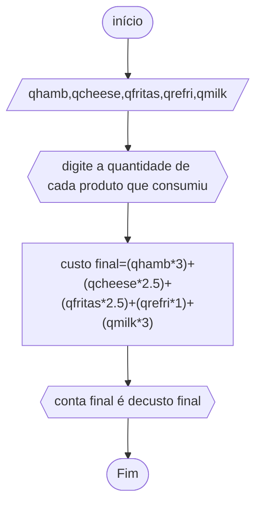

# UNIFOR
## FLUXOGRAMA
### EXERCÍCIO2.6


```
ALGORITMO
DECLARE qhamb,qcheese,qfritas,qrefri,qmilk
INÍCIO
ESCREVA"digite a quantidade de cada produto que consumiu"
LEIA qhamb,qcheese,qfritas,qrefri,qmilk
custo final<-- (qhburg * 3) + (qchees * 2,50) + (qfritas * 2,50) + (qrefri * 1) + (qmilk * 3)
ESCREVA "conta final é de"custo final
FIM_ALGORITMO
