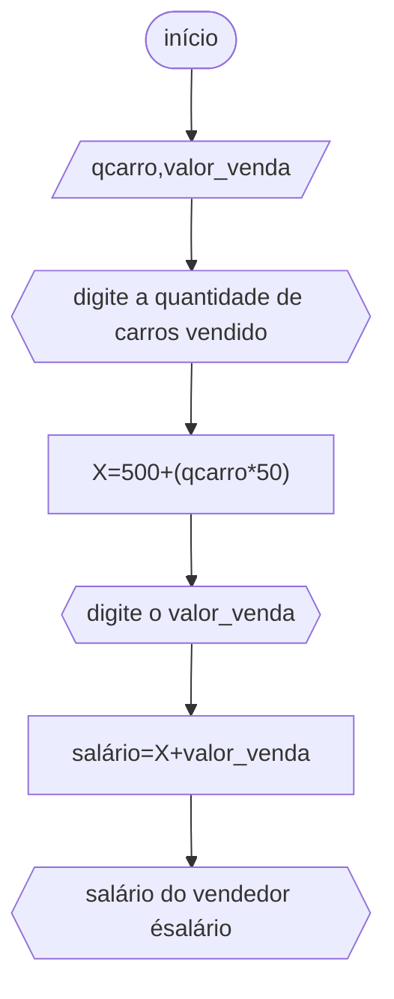

# unifor
## fluxograma
### exercício2.7


## pseudocódigo

```
ALGORITMO
DECLARE qcarro,valor_venda NÚMERICO
DECLARE nome
INÍCIO
ESCREVA"digite seu nome completo:"
LEIA nome
ESCREVA"digite a quantidade de carros vendido"
LEIA qcarro
X<--500+(qcarro*50)
ESCREVA"digite o valor_venda"
LEIA valor_venda
salário<--X+valor_venda
ESCREVA"salário do vendedor é"salário
FIM_ALGORITMO
```
