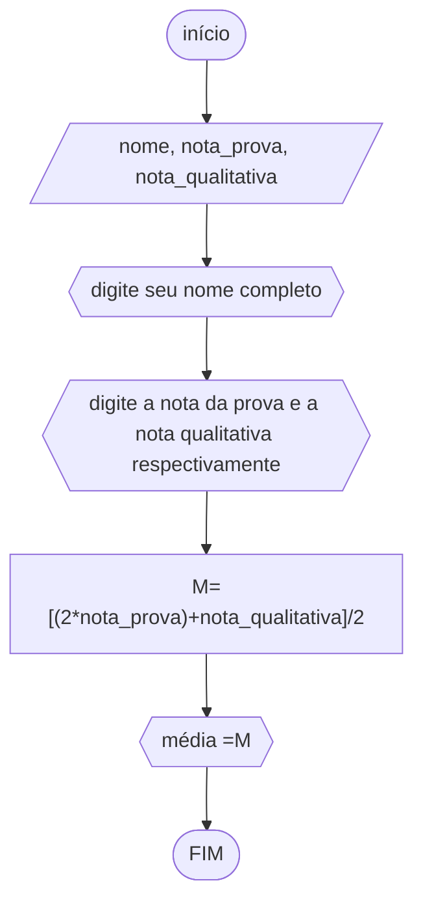

# unifor
## fluxograma
### exrcício2.8





## psedocódigo
```
ALGORITMO calcmédia
DECLARE nome
DECLARE nota_prova, nota_qualitativa NÚMERICO
INÍCIO
ESCREVA "digite seu nome completo"
LEIA nome
ESCREVA "digite a nota da prova e a nota qualitativa respectivamente"
LEIA  nota_prova, nota_qualitativa
M<--[(2*nota_prova)+nota_qualitativa]/2
ESCREVA "média ="M
FIM_ALGORITMO
```
