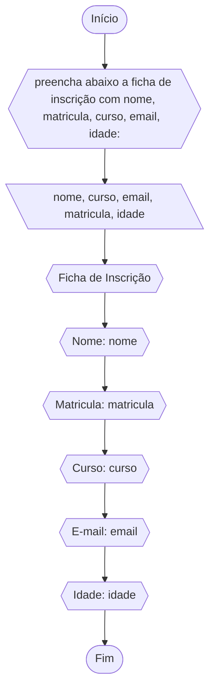

# unifor
## fluxograma
### exercício2.9

```mermaid
flowchart TD
A([Início])-->B{{"preencha abaixo a ficha de inscrição com nome, matricula, curso, email,  idade: "}}
B-->C[\nome, curso, email, matricula, idade\]
C-->D{{"Ficha de Inscrição"}}
D-->E{{"Nome: "nome}}
E-->F{{"Matricula: "matricula}}
F-->G{{"Curso: "curso}}
G-->H{{"E-mail: "email}}
H-->I{{"Idade: "idade}}
I-->J([Fim])
```
