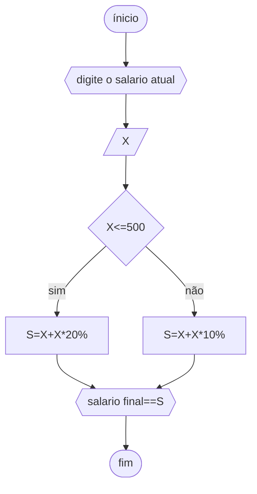

# UNIFOR
**Nome**: Nome do estudante <br>
**Disciplina**: Raciocínio lógico algorítmico

## Lista de exercícios 01

### Exercício 01 (1 ponto)
Represente, em fluxograma e pseudocódigo, um algoritmo para determinar se um número inteiro e positivo é par ou impar.

#### Fluxograma (0,25 ponto)


#### Pseudocódigo (0,5 ponto)
```
1  ALGORTIMO verifica_par_impar
2  DECLARE numero, resto: INTEIRO
3  ESCREVA "Digite um número: "
4  INICIO
4  LEIA numero
5  SE numero >= 0 ENTAO                  // verifica se o inteiro é positivo
6    resto = numero % 2                 // calcula o resto da divisão por 2
7    SE resto == 0 ENTAO                // verifica se o resto é igual a zero
8      ESCREVA "O número é par!"
9    SENAO
10     ESCREVA "O número é impar!"
11   FIM_SE
11  SENAO                                // caso inteiro for negativo (condição linha 5)
12    ESCREVA "O número deve ser postivo!"
13  FIM_SE
13 FIM
```

#### Teste de mesa (0,25 ponto)
| numero | numero >= 0 | resto | resto == 0 | Saída |
| -- | -- | -- | -- | -- | 
| -1 | F |   |   | "O número deve ser postivo!" |
| 0  | V | 0 | V | "O número é par!" |
| 13 | V | 1 | F | "O número é impar!" |
| 30 | V | 0 | V | "O número é par!" |

## Exercício 02 (3 pontos)
Represente, em fluxograma e pseudocódigo, um algoritmo para calcular o novo salário de um funcionário. 
Sabe-se que os funcionários que recebem atualmente salário de até R$ 500 terão aumento de 20%; os demais terão aumento de 10%.

#### Fluxograma (1.0 ponto)




#### Pseudocódigo (1.0 ponto)

```
Algoritmo ContaAprovacoes
DECLARE X, S NUMÉRICO
ESCREVA "DIGITE O SALÁRIO ATUAL"
LEIA X
SE X<=500
ENTÃO S⇐X+(X*20%)
SENÃO S⇐X+(X*10% )
ESCREVA "SALÁRIO FINAL=" S
FIM_ALGORITMO.
```


#### Teste de mesa (1.0 ponto)


## Exercício 03 (3 pontos)
Represente, em fluxograma e pseudocódigo, um algoritmo para calcular a média aritmética entre duas notas de um aluno e mostrar sua situação, que pode ser aprovado ou reprovado.

#### Fluxograma (1 ponto)


#### Pseudocódigo (1 ponto)

```ALGORITMO 
DECLARE N1, N2, M NÚMERICO
ESCREVA "DIGITE DOIS NÚMEROS"
LEIA N1,N2
soma ⇐N1+N2
M=soma//2
ESCREVA "MÈDIA="M
SE M>=6
ENTÃO ESCREVA "APROVADO"
SENÃO ESCREVA "REPROVADO"
FIM_ALGARITMO
```
#### Teste de mesa (1 ponto)


## Exercício 04 (3 pontos)
Represente, em fluxograma e pseudocódigo, um algoritmo que, a partir da idade do candidato(a), determinar se pode ou não tirar a CNH. 
Caso não atender a restrição de idade, calcular quantos anos faltam para o candidato estar apto.

#### Fluxograma (1.0 ponto)


#### Pseudocódigo (1.0 ponto)

```
ALGORITMO
DECLARE X NUMÉRICO
ESCREVA"DIGITE A IDADE DO CANDIDATO"
LEIA X
SE X>=18
ENTÃO ESCREVA "PODE TIRAR CNH"
SENÃO F⇐18-X
ESCREVA "FALTAM"F"ANO(s) PARA PODER TIRAR CNH" 
FIM_ALGORITMO
```

#### Teste de mesa (1.0 ponto)


