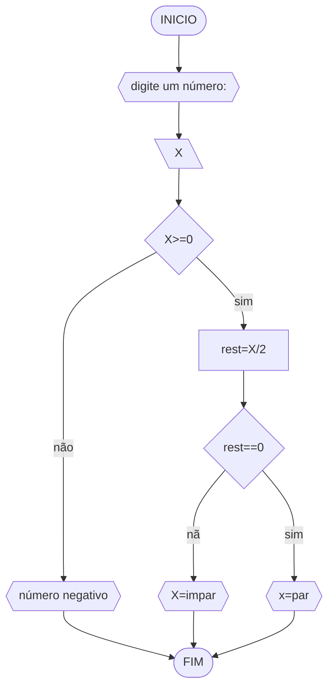

# UNIFOR
**Nome:** Suzani Jia Yi Wang
**Diciplina:** Raciocínio lógico algorítmico
## EXERXÍCIO 3
###  FLUXOGRAMA



### PSEDOCODIGO

``` Algoritmo verifica_par_ímpar
DECLARE X,R NUMERICO
ESCREVA "Digite um número inteiro:"
LEIA X
SE X >= 0 ENTAO
	R = X % 2
	SE R == 0 ENTAO
		ESCREVA"O X é par"
	SENAO
		ESCREVA "O X é ímpar"
SENAO 
	ESCREVA "O X é negativo"
FIM_ALGORITIMO ```
