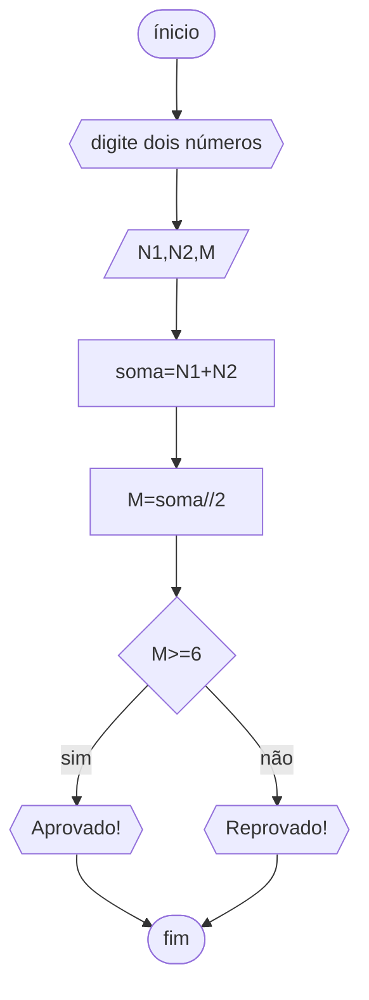

# Unifor raciocínio lógico algoritmico

## fluxugrama
### exercício 1


## pseudocódigo
```ALGORITMO 
DECLARE N1, N2, M NÚMERICO
ESCREVA "DIGITE DOIS NÚMEROS"
LEIA N1,N2
soma ⇐N1+N2
M=soma//2
ESCREVA "MÈDIA="M
SE M>=6
ENTÃO ESCREVA "APROVADO"
SENÃO ESCREVA "REPROVADO"
FIM_ALGARITMO
```


